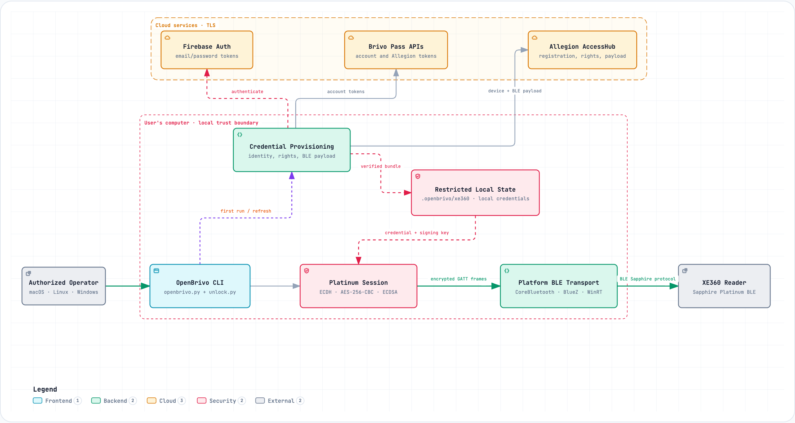

<div align="center">
  

  <p>
    <strong>Brivo access is normally mediated by a mobile app, leaving authorized users without a
    transparent desktop workflow to understand or operate their own XE360 locks.</strong>
  </p>

  <p>
    OpenBrivo fills that gap with a local-first Python CLI that pairs a Brivo Mobile Pass account with
    the native Bluetooth stack on macOS, Linux, or Windows to discover readers, provision credentials,
    and perform encrypted unlocks.
  </p>

  <p>
    Made <s>with ❤️</s> out of frustration by <a href="https://x.com/aseemshrey"><strong>@AseemShrey</strong></a>.
  </p>

  <p>
    <a href="#requirements"></a>
    <a href="#requirements"></a>
    <a href="#quick-start"></a>
    <a href="#security-notes"></a>
  </p>

  <p>
    <a href="#installation">Installation</a> ·
    <a href="#quick-start">Quick start</a> ·
    <a href="#commands">Commands</a> ·
    <a href="#architecture">Architecture</a> ·
    <a href="#security-notes">Security</a>
  </p>
</div>

---

> [!IMPORTANT]
> Use OpenBrivo only with accounts and locks you own or are explicitly
> authorized to access.

## At a Glance

| Local by default | Native Bluetooth |
| --- | --- |
| Routine unlocks use credentials cached on your computer—no hosted OpenBrivo service or telemetry. | CoreBluetooth powers macOS; Bleak uses BlueZ on Linux and WinRT on Windows. |
| **Inspectable design** | **Credential-aware** |
| Runtime modules, protocol code, and configuration assets remain separate and readable. | Signed payloads are verified before caching, credentials stay in restricted local storage, and passwords are never stored. |

OpenBrivo is distributed as a transparent folder. The entrypoint, BLE code,
protocol implementation, provisioning modules, Web UI, and named configuration
assets remain separate and inspectable. It does not require the rest of the
research repository, Swift, Android, or a shell bridge.

## Architecture



The default unlock path stays on the user's computer after provisioning:

1. `openbrivo.py` dispatches to the unlock workflow in `unlock.py`.
2. The owner-only credential bundle and P-256 identity are validated locally.
3. `PlatinumSessionOrchestrator` creates the encrypted Sapphire session.
4. The platform backend drives Bluetooth discovery, connection, and GATT transport.
5. The selected XE360 reader returns `credAccepted` or `credDenied`.

Cloud access is used only for first-time setup and explicit credential refresh.
Firebase authenticates the account, Brivo supplies account context and Allegion
tokens, and AccessHub registers the device and issues the signed BLE payload.

## Requirements

- macOS, Linux, or Windows with Bluetooth Low Energy hardware
- Python 3.10 or newer
- BlueZ 5.62 or newer on Linux
- Internet access during initial credential setup and later refreshes
- A valid Brivo Mobile Pass username and password

The unlock itself uses Bluetooth and cached credentials. After successful
setup, routine unlocks do not require a cloud request.

## Installation

Clone the private repository and create an isolated Python environment on
macOS or Linux:

```bash
git clone git@github.com:LuD1161/openbrivo.git
cd openbrivo
python3 -m venv .venv
source .venv/bin/activate
python -m pip install --upgrade pip
python -m pip install -r requirements.txt
```

On Windows PowerShell:

```powershell
git clone git@github.com:LuD1161/openbrivo.git
cd openbrivo
py -3.10 -m venv .venv
.venv\Scripts\Activate.ps1
python -m pip install --upgrade pip
python -m pip install -r requirements.txt
```

Verify the installation:

```bash
python openbrivo.py --help
python openbrivo.py scan --scan-seconds 5
```

On the first scan, macOS may request Bluetooth permission, Windows may ask you
to enable Bluetooth, and Linux requires a running BlueZ service with permission
to access it.

## Quick Start

With the environment active, start the guided unlock flow:

```bash
python openbrivo.py
```

Running without a subcommand is equivalent to `python openbrivo.py unlock`.

On the first run, OpenBrivo will:

1. Prompt for the Brivo username and password without echoing the password.
2. Generate a unique P-256 device identity for this Mac.
3. Register the device and retrieve the account's XE360 BLE credential.
4. Save an owner-only credential cache.
5. Scan for nearby XE360 locks and ask which one to unlock.

Later runs validate and reuse the cached identity and credential. If a lock
denies the credential, OpenBrivo lets you select another lock or explicitly
refresh the credential.

## Web UI

Start the loopback-only research workbench with:

```bash
python openbrivo.py --ui --port 8787
```

Then open `http://127.0.0.1:8787`. The Web UI provides reader inspection,
credential utilities, and a synthetic handshake lab. Real XE360 unlocking is
performed by the native CLI with `python openbrivo.py`.

## Commands

| Task | Command |
| --- | --- |
| Start the guided unlock flow | `python openbrivo.py` |
| Scan without connecting | `python openbrivo.py scan` |
| Run a longer, 20-second scan | `python openbrivo.py scan --scan-seconds 20` |
| Unlock explicitly | `python openbrivo.py unlock` |
| Unlock in the EU region | `python openbrivo.py unlock --region EU --scan-seconds 20` |
| Exchange account credentials | `python openbrivo.py exchange --region US` |
| Validate an access token | `python openbrivo.py validate --region US --token TOKEN` |
| Refresh a Firebase token | `python openbrivo.py refresh --region US --token REFRESH_TOKEN --firebase` |

Avoid putting passwords directly on the command line because shell history and
process listings may expose them. Let OpenBrivo prompt instead.

## Local Files

OpenBrivo stores durable state relative to the directory where it is run:

```text
./.openbrivo/xe360/
```

This directory contains the device identity, credential bundle, reader pins,
and sanitized audit logs. On macOS and Linux, secret files use mode `0600` and
directories use mode `0700`. Windows retains the ACL inherited from the working
directory, so run OpenBrivo from a private directory in your user profile.
Passwords are never saved.

Run OpenBrivo from the same writable directory each time if you want it to use
the same credential cache.

The application contains no encoded runtime payload and performs no temporary
self-extraction. Runtime code is readable under `brivo_poc/`; APK-derived
regional and Allegion configuration files are named under `assets/`.

## Repository Layout

```text
openbrivo.py       CLI entrypoint; no subcommand defaults to unlock
unlock.py          Cross-platform BLE transports, selection, and TUI
terminal_ui.py     ANSI styling with NO_COLOR support
brivo_poc/         Provisioning, bundle validation, protocol, and session state
assets/            Named APK-derived regional and Allegion configuration
index.html         Loopback Web UI
docs/              Archify architecture specification, viewer, and evidence
requirements.txt   Pinned Python dependencies
```

## Colors

Colors are enabled automatically in an interactive terminal. Disable them with:

```bash
NO_COLOR=1 python openbrivo.py scan
```

In Windows PowerShell, use `$env:NO_COLOR=1` before running the command.

Colors are also disabled automatically when output is redirected or the
terminal reports `TERM=dumb`.

## Troubleshooting

### Missing Bluetooth backend

Install the platform dependencies from the active environment:

```bash
python -m pip install -r requirements.txt
```

This installs PyObjC on macOS and Bleak on Linux or Windows automatically.

### `Missing dependency: cryptography`

Install the cryptography package:

```bash
python -m pip install cryptography==42.0.5
```

### Bluetooth is unavailable or unauthorized

Enable Bluetooth and grant access to the terminal running OpenBrivo. On macOS,
use **System Settings > Privacy & Security > Bluetooth**. On Linux, verify that
BlueZ 5.62 or newer is running. On Windows, verify that Bluetooth is enabled in
**Settings > Bluetooth & devices**.

### No XE360 locks found

Move closer to the lock and choose re-scan. XE360 advertisements rotate, so a
longer scan can help:

```bash
python openbrivo.py unlock --scan-seconds 20
```

### Credential denied

A successful encrypted connection followed by `credential denied` means that
reader did not accept the account's credential. Choose another nearby lock if
appropriate, or refresh the credential from the prompt.

## Security Notes

- Network requests go directly to Firebase, Brivo, and Allegion over TLS.
- OpenBrivo has no hosted backend or telemetry service.
- AccessHub responses are signature-verified before credentials are cached.
- The local signing identity and BLE credential should be treated as secrets.
- Do not share `.openbrivo/xe360/` or include it in a distributable archive.
